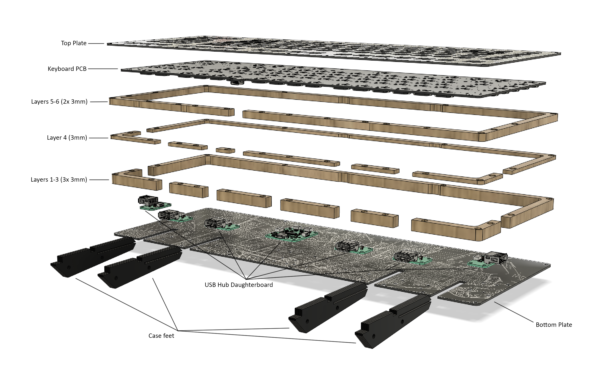

# Stacked case files

These files are for the stacked case variant.
- `Layers 1-4 combined.dxf` and `Layers 5-6 combined.dxf` are both designed to fit on a 3mm 24" x 12" sheet of material of your choice (preferably acrylic). These 2 files contain everything needed for the 6 layers, combined with shared edges between the different parts.
- `Layers 1-3.dxf`, `Layer 4.dxf`, and `Layers 5-6.dxf` are for the individual layers. 
  - `Layers 1-3.dxf` should be produced with 9mm worth of material. Thickness variance within ±1mm is allowed.
  - `Layer 4.dxf` should be produced with 3mm worth of material.
  - `Layers 5-6.dxf` should be produced with 6mm worth of material. No variance in thickness is allowed.

## Diagram

