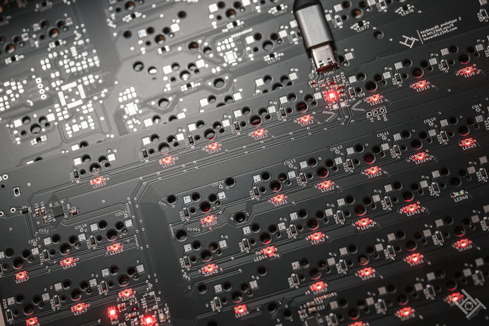
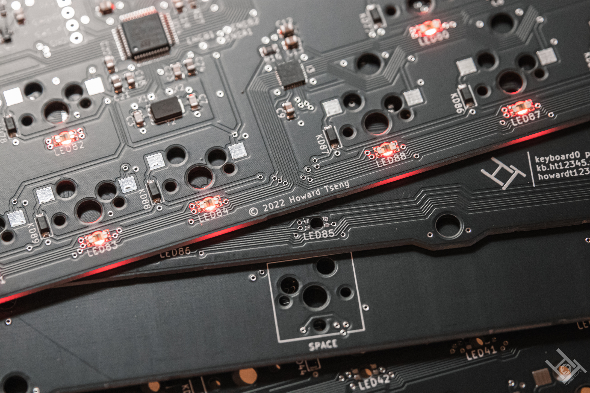
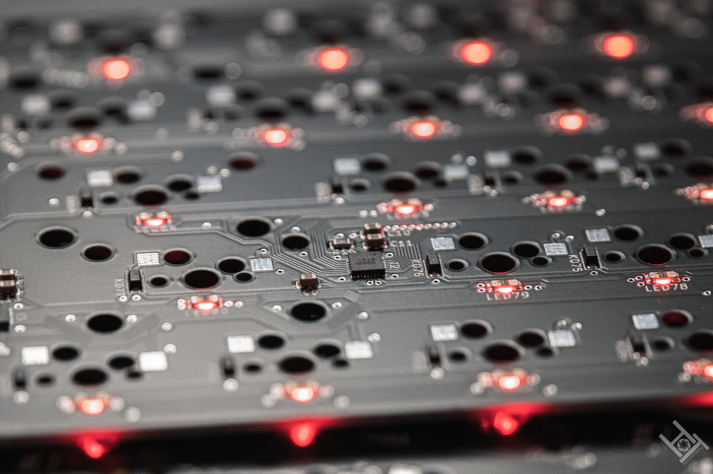
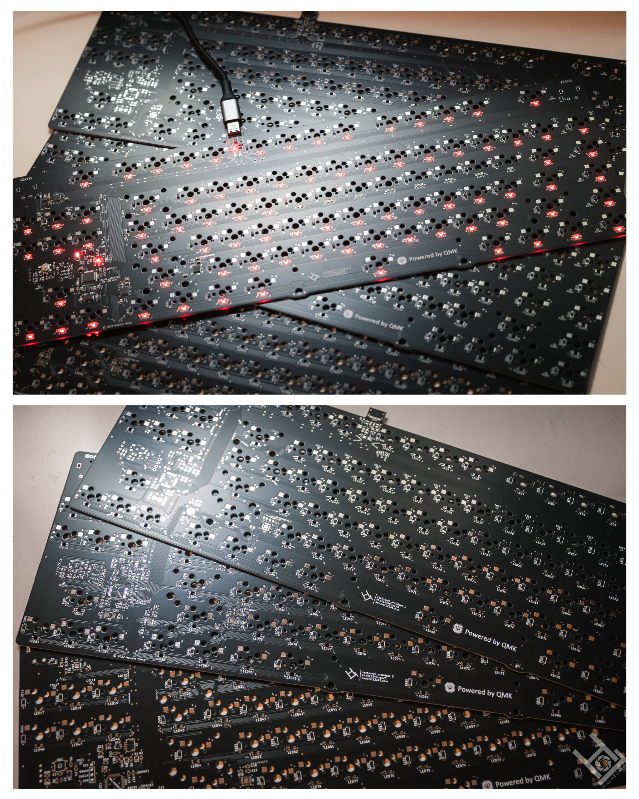

# 2nd prototype of keyboard0

I have *personally* confirmed this prototype version to be working.

---

---

# Notable flaws:
- The footprint for the MHT151RGBCT RGB LEDs will consistently give a DRC error in Kicad. The current footprint follows the specifications found in the [datasheet](https://datasheet.lcsc.com/lcsc/2104121904_MEIHUA-MHT151RGBCT_C409782.pdf), which creates several points where pads are considered to be too close to other pads. Although there are no noticeable issues with the functionality of the LEDs with my personal prototype units, manufacturing errors have a potential to appear, whether in the PCB production process or the assembly process. 
- Vias are not tented in the given Gerber files. Although intended for debugging purposes, it would not be great in production.
- The IS31FL3731 is not the best LED driver, and the RGB LEDs will flicker after a while. This is a result of JLCPCB only having IS31FL3731 chips when creating this prototype version. Switching to a IS31FL3733 in future versions would be ideal, if it becomes available.
- This prototype has both an integrated USB-C port and provisions for a JST connection for a daughterboard. The integrated USB-C port would ideally be removed in future versions, opting to use only a daughterboard as the USB connection. 
- The spacebar stabilizer is south facing to maintain compatibility with the v1 plate. As such, the bottom of the PCB requires slightly more room to accommodate the stabilizer. The stabilizer orientation would be rotated in future versions.
- The USB lines have test points, which should be removed.

---

## These files are provided without liability and without any guarantee with regards to functionality. These files are NOT to be used for commercial purposes, as expressed in the [Creative Commons Attribution-NonCommercial-ShareAlike 4.0 International License][cc-by-nc-sa].

[cc-by-nc-sa]: http://creativecommons.org/licenses/by-nc-sa/4.0/