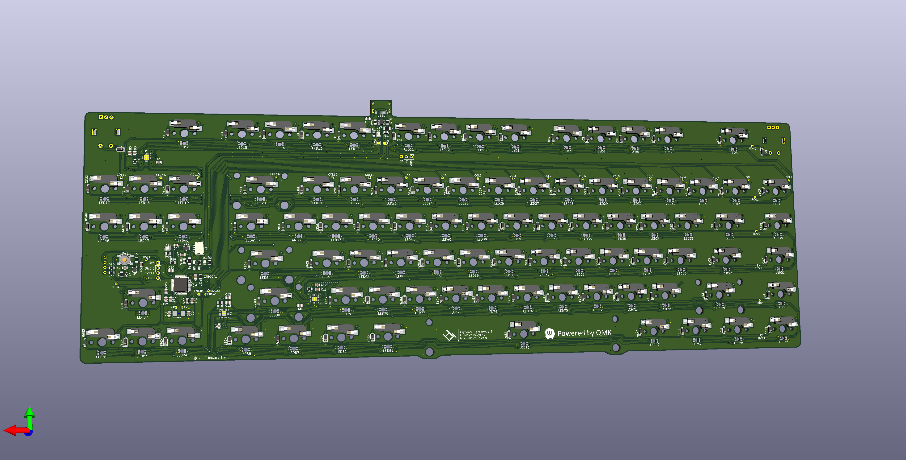

# keyboard0
[![CC BY-NC-SA 4.0][cc-by-nc-sa-shield]][cc-by-nc-sa]

## This project is currently under active development. Everything is subject to change.

### Tenkeyless (TKL) hot-swap mechanical keyboard with macro keys column, 2 rotary encoders, and OLED display

The PCB uses Kailh Hot-swap sockets. The original specifications also wanted a USB hub, which will be implemented through a separate USB hub daughterboard. 

[The layout on keyboard layout editor](http://www.keyboard-layout-editor.com/#/gists/689bc560553c37fa0d04dfba9f11ed96)
[Prototype showcase photos on @howardt12345](https://www.instagram.com/p/CYXeXJdg_eP/)

---

[links here]

---
## All of the files in this repository, including the PCBs, are provided without liability and without any guarantee with regards to functionality. Any production files and prototypes from this project are provided without warranty of any kind.

---

This work is licensed under a
[Creative Commons Attribution-NonCommercial-ShareAlike 4.0 International License][cc-by-nc-sa].

[![CC BY-NC-SA 4.0][cc-by-nc-sa-image]][cc-by-nc-sa]

[cc-by-nc-sa]: http://creativecommons.org/licenses/by-nc-sa/4.0/
[cc-by-nc-sa-image]: https://licensebuttons.net/l/by-nc-sa/4.0/88x31.png
[cc-by-nc-sa-shield]: https://img.shields.io/badge/License-CC%20BY--NC--SA%204.0-lightgrey.svg